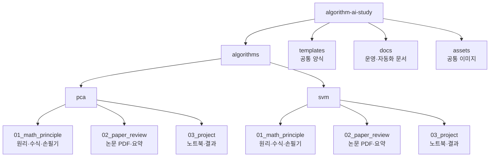

# Algorithm & AI Study Lab

머신러닝 알고리즘을 **원리 분석 → 문헌 기반 사례 분석 → 데이터 적용 실험**의 흐름으로 공부하고 기록하는 스터디 저장소입니다.

스터디의 목표는 특정 라이브러리 사용법을 빠르게 익히는 것이 아니라, 하나의 알고리즘을 다음 세 관점에서 반복적으로 학습하는 것입니다.

1. 알고리즘의 수학적 구조를 이해한다.
2. 실제 논문과 사례에서 알고리즘이 어떻게 쓰이는지 확인한다.
3. 직접 데이터에 적용하며 결과를 해석한다.

## Study Flow

| 단계 | 공부 방식 | 사용하는 자료 | 정리 위치 |
|---|---|---|---|
| 01. Principle Analysis | 알고리즘의 가정, 목적함수, 핵심 수식, 최적화 구조를 공부합니다. | 교재, 손필기 노트, 발표 자료 | `01_math_principle/` |
| 02. Paper Review | 논문에서 문제 설정, 데이터, 방법론, 결과를 읽고 알고리즘의 활용 방식을 정리합니다. | 논문 PDF, Notion 보고서 | `02_paper_review/` |
| 03. Applied Project | 공개 데이터셋에 알고리즘을 적용하고 실험 결과를 해석합니다. | Kaggle, Dacon, 공공 데이터, `.ipynb` | `03_project/` |

## Repository Map

## Algorithms

| 알고리즘 | 원리 분석 | 논문 리뷰 | 적용 프로젝트 |
|---|---|---|---|
| [PCA](algorithms/pca/README.md) | 정리 중 | 정리 중 | 정리 중 |
| [SVM](algorithms/svm/README.md) | 정리 중 | [보기](algorithms/svm/02_paper_review/README.md) | 예정 |

## Notion and GitHub

| 도구 | 역할 |
|---|---|
| Notion | 일정 관리, 과제 제출, 원본 보고서 작성 |
| GitHub | PDF, 코드, 노트북, 결과 이미지, 요약본 보관 |
