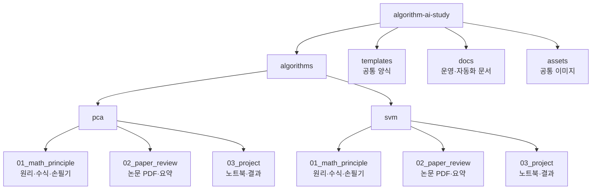

# Algorithm & AI Study Lab

머신러닝 알고리즘 스터디 기록 보관소입니다.

본 스터디는 다음과 같은 목표 아래 데이터 분석 전문가를 꿈꾸는 3명의 스터디원들과 함께 진행되고 있습니다.
1. ML/AI의 알고리즘 구현에 사용되는 수학적 원리 및 구조를 이해
2. 알고리즘의 실제 사용 사례 및 최신 동향을 연구한 논문을 이해
3. 실제 데이터에 알고리즘을 적용하여 모델을 설계·학습·평가·피드백하는 미니 프로젝트를 수행

즉, ML/AI의 **기본적인 수학적 원리 → 문헌 기반 사례 분석 → 데이터 적용 실험**의 흐름으로 학습하고 상호 피드백 및 질의 과정으로 운영되고 있습니다.

저희 스터디는 다음의 자료를 사용하고 있습니다.
- 이론교재: 단단한 머신러닝
- 논문, 보고서: 자유
- 미니프로젝트 및 데이터: 자유

스터디원들이 열심히 학습하고 기록한 자료를 확인하고 싶으시다면 아래의 링크를 클릭하여, 알고리즘 주제별 학습 자료를 참고해주세요!

## Study Flow

| 단계 | 공부 방식 | 사용하는 자료 | 정리 위치 |
|---|---|---|---|
| 01. Principle Analysis | 알고리즘의 가정, 목적함수, 핵심 수식, 최적화 원리를 학습합니다. | 교재, 손필기 노트, 발표 자료 | `01_math_principle/` |
| 02. Paper Review | 논문에서 문제 설정, 데이터, 방법론, 결과를 읽고 알고리즘의 활용 방식을 정리합니다. | 논문 PDF, Notion 보고서 | `02_paper_review/` |
| 03. Applied Project | 공개 데이터셋에 알고리즘을 적용하고 실험 결과를 해석합니다. | Kaggle, Dacon, 공공 데이터, `.ipynb` | `03_project/` |

## Repository Map

## Algorithms

| 알고리즘 | 원리 분석 | 논문 리뷰 | 적용 프로젝트 |
|---|---|---|---|
| [PCA](algorithms/pca/README.md) | 정리 중 | 정리 중 | 정리 중 |
| [SVM](algorithms/svm/README.md) | 정리 중 | [보기](algorithms/svm/02_paper_review/README.md) | 예정 |

## Notion and GitHub

| 도구 | 역할 |
|---|---|
| Notion | 일정 관리, 과제 제출, 원본 보고서 작성 |
| GitHub | PDF, 코드, 노트북, 결과 이미지, 요약본 보관 |
