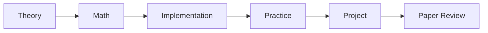

# Algorithm & AI Study Lab

알고리즘 이론, 관련 수학, 직접 구현, 적용 프로젝트, 논문 리딩을 연결해서 공부하는 데이터/AI 알고리즘 스터디입니다.

## Study Flow



## Repository Structure

```text
algorithm_ai_study/
  algorithms/        # 알고리즘별 학습 자료
  projects/          # 여러 알고리즘을 적용한 미니 프로젝트
  papers/            # 논문 리뷰 모음
  templates/         # 공통 작성 양식
  assets/            # README 이미지, 발표용 이미지
```

## Study Topics

| Topic | Theory | Math | Implementation | Project | Paper |
|---|---|---|---|---|---|
| Graph | Planned | Planned | Planned | Planned | Planned |
| Dynamic Programming | Planned | Planned | Planned | Planned | Planned |
| Optimization | Planned | Planned | Planned | Planned | Planned |

## Outputs

| Type | Title | Link |
|---|---|---|
| Implementation | - | - |
| Project | - | - |
| Paper Review | - | - |

## How We Work

- 파일명과 폴더명은 영어 소문자와 `_`를 사용합니다.
- 알고리즘별 자료는 `algorithms/` 아래에 정리합니다.
- 여러 알고리즘을 섞어 만든 결과물은 `projects/`에 정리합니다.
- 논문 리뷰는 `papers/`에 모읍니다.
- 개인 작업은 브랜치에서 진행하고, 정리된 내용은 Pull Request로 `main`에 반영합니다.

## Members

| Name | Main Topic | Role |
|---|---|---|
| PJH | - | - |

## References

- TheAlgorithms/Python
- DataTalksClub Machine Learning Zoomcamp
- Microsoft Data Science for Beginners

