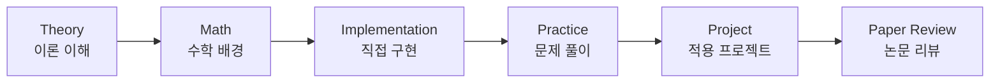

# Algorithm & AI Study Lab


알고리즘 이론, 데이터 수학, 코드 구현, AI 프로젝트, 논문 리딩을 함께하는 데이터/AI 알고리즘 스터디입니다.

하나의 알고리즘을 **이론 -> 수학 -> 구현 -> 실험 -> 프로젝트 -> 논문 리뷰**까지 이어서 정리하는 것을 목표로 합니다.

## Study Flow



## Repository Structure

```text
algorithm_ai_study/
  algorithms/              # 알고리즘별 학습 자료
    graph/
    dynamic_programming/
    optimization/
  projects/                # 여러 알고리즘을 적용한 미니 프로젝트
  papers/                  # 논문 리뷰 모음
  templates/               # 공통 작성 양식
  docs/                    # 팀원용 안내 문서
  assets/                  # README 이미지, 구조도, 발표용 이미지
```

## Folder Guide

| Folder | Purpose |
|---|---|
| `algorithms/` | 알고리즘별 이론, 수학, 구현, 문제 풀이, 프로젝트, 논문 리뷰를 정리합니다. |
| `algorithms/<topic>/theory.md` | 해당 알고리즘의 핵심 개념을 정리합니다. |
| `algorithms/<topic>/math.md` | 알고리즘을 이해하는 데 필요한 수학적 배경을 정리합니다. |
| `algorithms/<topic>/implementation/` | 직접 구현한 코드를 저장합니다. |
| `algorithms/<topic>/practice/` | 백준, 프로그래머스, 예제 문제 풀이를 저장합니다. |
| `algorithms/<topic>/project/` | 해당 알고리즘을 적용한 작은 실험이나 프로젝트를 저장합니다. |
| `algorithms/<topic>/papers.md` | 관련 논문과 읽은 내용을 정리합니다. |
| `projects/` | 여러 알고리즘을 함께 사용한 프로젝트 결과물을 정리합니다. |
| `papers/` | 알고리즘 주제와 관계없이 전체 논문 리뷰를 모아둡니다. |
| `templates/` | 팀원들이 같은 형식으로 정리할 수 있도록 양식을 제공합니다. |
| `docs/` | 협업 방식, 폴더 사용법 등 팀원 안내 문서를 저장합니다. |
| `assets/` | README 또는 발표 자료에 사용할 이미지와 구조도를 저장합니다. |

자세한 폴더 설명은 [docs/folder_guide.md](docs/folder_guide.md)를 참고합니다.

## Study Topics

| Topic | Theory | Math | Implementation | Practice | Project | Paper |
|---|---|---|---|---|---|---|
| Graph | Planned | Planned | Planned | Planned | Planned | Planned |
| Dynamic Programming | Planned | Planned | Planned | Planned | Planned | Planned |
| Optimization | Planned | Planned | Planned | Planned | Planned | Planned |

## Outputs

| Type | Title | Topic | Link |
|---|---|---|---|
| Implementation | - | - | - |
| Project | - | - | - |
| Paper Review | - | - | - |

## How We Work

- 파일명과 폴더명은 영어 소문자와 `_`를 사용합니다.
- 알고리즘별 자료는 `algorithms/` 아래에 정리합니다.
- 여러 알고리즘을 섞어 만든 결과물은 `projects/`에 정리합니다.
- 논문 리뷰는 `papers/`에 모읍니다.
- 개인 작업은 브랜치에서 진행하고, 정리된 내용은 Pull Request로 `main`에 반영합니다.
- `data/`, `outputs/`, `models/`처럼 용량이 크거나 개인 환경에 따라 달라지는 파일은 GitHub에 올리지 않습니다.

## Members

| Name | Main Topic | Role |
|---|---|---|
| 박중현 | - | 스터디원 |
| 강재성 | - | 스터디원 |
| 신정윤 | - | 스터디원 |
## References

- [TheAlgorithms/Python](https://github.com/TheAlgorithms/Python)
- [DataTalksClub Machine Learning Zoomcamp](https://github.com/DataTalksClub/machine-learning-zoomcamp)
- [Microsoft Data Science for Beginners](https://github.com/microsoft/Data-Science-For-Beginners)


